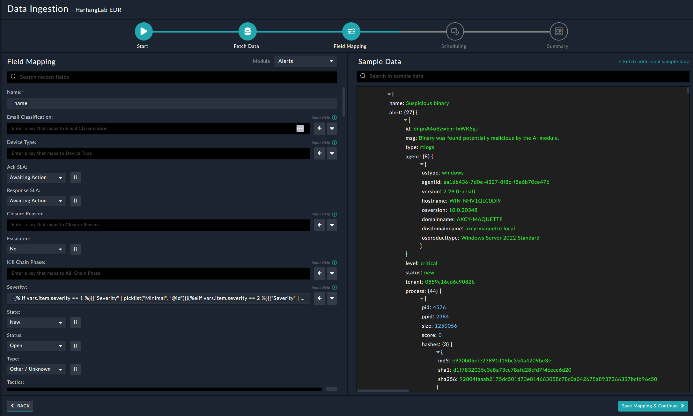

## About the connector
The connector allows FortiSOAR users to fetch data and take actions on Hurukai HarfangLab EDR platform

This document provides information about the HarfangLab EDR Connector, which facilitates automated interactions, with a HarfangLab EDR server using FortiSOAR&trade; playbooks. Add the HarfangLab EDR Connector as a step in FortiSOAR&trade; playbooks and perform automated operations with HarfangLab EDR.

### Version information

Connector Version: 1.1.0

Authored By: Naili.M

Certified: No
## Release Notes for version 1.1.0
Following enhancements have been made to the HarfangLab EDR Connector in version 1.1.0:
<ul>
<li>Added Data Ingestion Support. </li>
</ul>

## Installing the connector

Use the <strong>Content Hub</strong> to install the connector. For the detailed procedure to install a connector, click <a href="https://docs.fortinet.com/document/fortisoar/0.0.0/installing-a-connector/1/installing-a-connector" target="_top">here</a>.

You can also use the <code>yum</code> command as a root user to install the connector:

<pre>yum install cyops-connector-harfanglab-edr</pre>

## Prerequisites to configuring the connector
- You must have the credentials of HarfangLab EDR server to which you will connect and perform automated operations.
- The FortiSOAR&trade; server should have outbound connectivity to port 443 on the HarfangLab EDR server.

## Minimum Permissions Required
- Not applicable

## Configuring the connector
For the procedure to configure a connector, click [here](https://docs.fortinet.com/document/fortisoar/0.0.0/configuring-a-connector/1/configuring-a-connector)
### Configuration parameters

In FortiSOAR&trade;, on the Connectors page, click the <strong>HarfangLab EDR</strong> connector row (if you are in the <strong>Grid</strong> view on the Connectors page) and in the <strong>Configurations</strong> tab enter the required configuration details:

<table border=1><thead><tr><th>Parameter</th><th>Description</th></tr></thead><tbody><tr><td>Server URL</td><td>URL for the HarfangLab EDR server from where the connector gets notifications.
</td>
</tr><tr><td>API Key</td><td>API Token configured for your account to access the HarfangLab EDR platform.
</td>
</tr><tr><td>Verify SSL</td><td>Specifies whether the SSL certificate for the server is to be verified or not.  By default, this option is set to True.</td></tr>
</tbody></table>

## Actions supported by the connector
The following automated operations can be included in playbooks and you can also use the annotations to access operations:
<table border=1><thead><tr><th>Function</th><th>Description</th><th>Annotation and Category</th></tr></thead><tbody><tr><td>Search Endpoints</td><td>Search an endpoint in HarfangLab EDR manager.</td><td>search_endpoint  Investigation</td></tr>
<tr><td>Fetch Security Events</td><td>Fetches security events from a HarfangLab EDR manager.</td><td>fetch_security_events  Investigation</td></tr>
<tr><td>Get Event By ID</td><td>Get a security event by its ID</td><td>get_event_by_id  Investigation</td></tr>
<tr><td>Isolate an Endpoint</td><td>Isolate the target endpoint from the network</td><td>isolate_endpoint  Response</td></tr>
<tr><td>Unisolate an Endpoint</td><td>Unisolate the target endpoint from the network</td><td>unisolate_endpoint  Response</td></tr>
<tr><td>Change Security Event Status</td><td>Changes the status of a security event</td><td>change_security_event_status  Incident_management</td></tr>
<tr><td>Search Multiple IoCs</td><td>Search multiple IOCs in HarfangLab telemetry and returns search results</td><td>search_multiple_iocs_in_telemetry  Incident_management</td></tr>
</tbody></table>

### operation: Search Endpoints
#### Input parameters
<table border=1><thead><tr><th>Parameter</th><th>Description</th></tr></thead><tbody><tr><td>Hostname</td><td>The machine hostname to find
</td></tr><tr><td>OS Type</td><td>Filter by Operating System type
</td></tr><tr><td>Status</td><td>Filter by status
</td></tr><tr><td>Select Fields</td><td>Return only these fields
</td></tr><tr><td>Records To Skip</td><td>Start fetching from this record index
</td></tr><tr><td>Max Records</td><td>Maximum records count to fetch
</td></tr></tbody></table>

#### Output
The output contains the following populated JSON schema:

The output contains a non-dictionary value.
### operation: Fetch Security Events
#### Input parameters
<table border=1><thead><tr><th>Parameter</th><th>Description</th></tr></thead><tbody><tr><td>Fetch Since</td><td>The number of minutes to look back for alerts
</td></tr><tr><td>Alert Status</td><td>Status of alerts to fetch (ACTIVE for alerts in the new, probable_false_positive or investigating statuses, CLOSED for alerts in the closed or false_positive states, leave it empty for all alerts
</td></tr><tr><td>Alert Type</td><td>A comma-separated list of alert types (e.g: sigma,yara,hlai) or leave it empty to fetch all types
</td></tr><tr><td>Severity</td><td>The minimum severity of alerts to fetch (Informational or None for Informational and higher, Low for Low and higher, Medium for Medium and higer, High for High and higher, Critical for Critical)
</td></tr><tr><td>Max Records</td><td>The maximum number of alerts to fetch (leave it empty to remove the limit)
</td></tr><tr><td>Delay</td><td>Number of seconds back in the past for the upper limit of security event timestamps (keep a value of minimum 120 secondes). If Fetch Since determines the oldest event to fetch, Last Fetch detrmines the most recent
</td></tr></tbody></table>

#### Output
The output contains the following populated JSON schema:

The output contains a non-dictionary value.
### operation: Get Event By ID
#### Input parameters
<table border=1><thead><tr><th>Parameter</th><th>Description</th></tr></thead><tbody><tr><td>Event ID</td><td>ID of the event to fetch
</td></tr></tbody></table>

#### Output
The output contains the following populated JSON schema:

The output contains a non-dictionary value.
### operation: Isolate an Endpoint
#### Input parameters
<table border=1><thead><tr><th>Parameter</th><th>Description</th></tr></thead><tbody><tr><td>Agent ID</td><td>ID of the agent to isolate
</td></tr></tbody></table>

#### Output
The output contains the following populated JSON schema:

The output contains a non-dictionary value.
### operation: Unisolate an Endpoint
#### Input parameters
<table border=1><thead><tr><th>Parameter</th><th>Description</th></tr></thead><tbody><tr><td>Agent ID</td><td>ID of the agent to unisolate
</td></tr></tbody></table>

#### Output
The output contains the following populated JSON schema:

The output contains a non-dictionary value.
### operation: Change Security Event Status
#### Input parameters
<table border=1><thead><tr><th>Parameter</th><th>Description</th></tr></thead><tbody><tr><td>Event ID</td><td>ID or list of IDs of the event(s) to change the status for
</td></tr><tr><td>Event Status</td><td>Status of alerts to fetch (ACTIVE for alerts in the new, probable_false_positive or investigating statuses, CLOSED for alerts in the closed or false_positive states, leave it empty for all alerts
</td></tr></tbody></table>

#### Output
The output contains the following populated JSON schema:

The output contains a non-dictionary value.
### operation: Search Multiple IoCs
#### Input parameters
<table border=1><thead><tr><th>Parameter</th><th>Description</th></tr></thead><tbody><tr><td>IoCs</td><td>The IOCs to search in the following format [{'type': 'md5', value: '1234567890ABCDEF1234567890ABCDEF'}, ...] (ip, hash, filename...)
</td></tr><tr><td>Search Types</td><td>Indicates which types of search to perform
</td></tr><tr><td>Output Format</td><td>The output format (either MARKDOWN or HTML)
</td></tr><tr><td>Limit</td><td>Limits the number of hit results for each IOC to this number.
</td></tr></tbody></table>

#### Output
The output contains the following populated JSON schema:

The output contains a non-dictionary value.
## Included playbooks
The `Sample - harfanglab-edr - 1.1.0` playbook collection comes bundled with the HarfangLab EDR connector. These playbooks contain steps using which you can perform all supported actions. You can see bundled playbooks in the **Automation** > **Playbooks** section in FortiSOAR&trade; after importing the HarfangLab EDR connector.

- > HarfangLabEDR > Fetch
- Change Security Event Status
- Fetch Security events
- Get Event By ID
- HarfangLabEDR> Ingest
- Isolate Endpoint
- Search Endpoints
- Search Multiple IoCs
- Unisolate Endpoint

**Note**: If you are planning to use any of the sample playbooks in your environment, ensure that you clone those playbooks and move them to a different collection since the sample playbook collection gets deleted during connector upgrade and delete.
## Data Ingestion Support

Use the Data Ingestion Wizard to easily ingest data into FortiSOAR™ by pulling events from HarfangLab EDR. Currently, "events" in HarfangLab EDR are mapped to "alerts" in FortiSOAR™. For more information on the Data Ingestion Wizard, see the "Connectors Guide" in the FortiSOAR™ product documentation. 

Configure Data Ingestion
You can configure data ingestion using the “Data Ingestion Wizard” to seamlessly map the incoming HarfangLab EDR "events" to FortiSOAR™ "Alerts".

The Data Ingestion Wizard enables you to configure scheduled pulling of data from HarfangLab EDR into FortiSOAR™. It also lets you pull some sample data from HarfangLab EDR using which you can define the mapping of data between HarfangLab EDR and FortiSOAR™. The mapping of common fields is generally already done by the Data Ingestion Wizard; users mostly require to only map any custom fields that are added to the HarfangLab EDR events. 

1.   To begin configuring data ingestion, click Configure Data Ingestion on the HarfangLab EDR connector’s "Configurations" page. 
Click Let’s Start by fetching some data, to open the “Fetch Sample Data” screen.

Sample data is required to create a field mapping between the HarfangLab EDR events data and FortiSOAR™. The sample data is pulled from connector actions or ingestion playbooks.
2.  On the Fetch Data screen, provide the configurations required to fetch events from HarfangLab EDR. The fetched data is used to create a mapping between the HarfangLab EDR data and FortiSOAR™ alerts. 

Once you have completed specifying the configurations, click Fetch Data.
3.  On the Field Mapping screen, map the fields of the HarfangLab EDR events to the fields present in FortiSOAR™ alert module. To map a field, click the key in the sample data to add the “jinja” value of the field.

For more information on field mapping, see the Data Ingestion chapter in the "Connectors Guide" in the FortiSOAR™ product documentation. Once you have completed mapping fields, click Save Mapping & Continue.
4.  Use the Scheduling screen to configure schedule-based ingestion, i.e., specify the polling frequency to HarfangLab EDR, so that the content gets pulled from HarfangLab EDR integration into FortiSOAR™. On the Scheduling screen, from the Do you want to schedule the ingestion? drop-down list, select Yes. In the “Configure Schedule Settings” section, specify the Cron expression for the schedule. For example, if you want to pull data from HarfangLab EDR every 5 minutes, click Every X Minute, and in the minute box enter */5. This would mean that based on the configuration you have set up, data, i.e., events will be pulled from HarfangLab EDR every 5 minutes.

Once you have completed scheduling, click Save Settings & Continue.
5.  The Summary screen displays a summary of the mapping done, and it also contains links to the Ingestion playbooks. Click Done to complete the data ingestion and exit the Data Ingestion Wizard.

